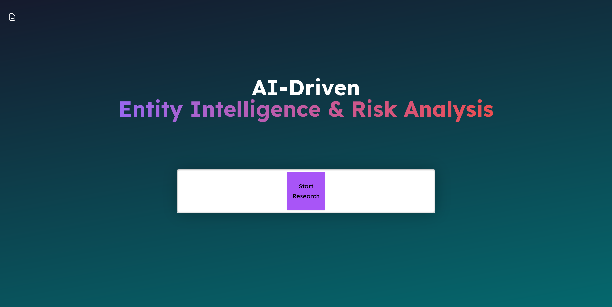
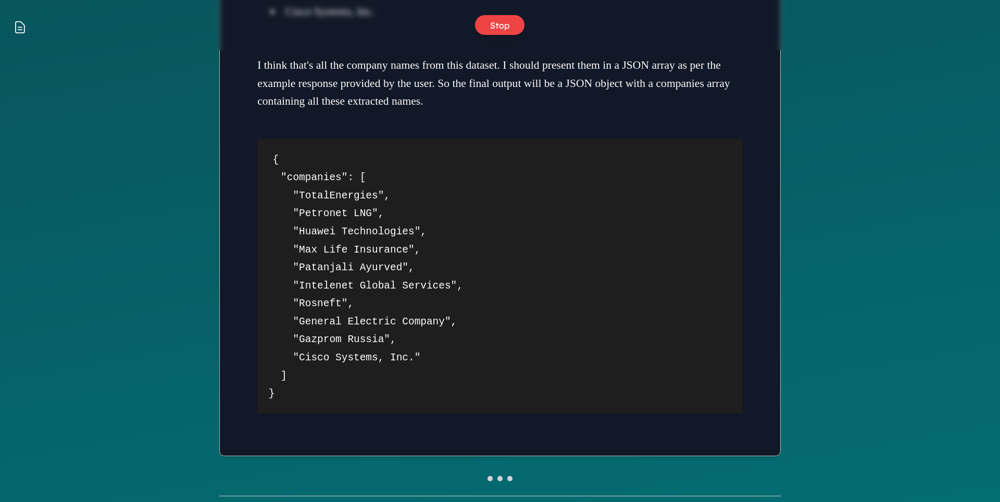
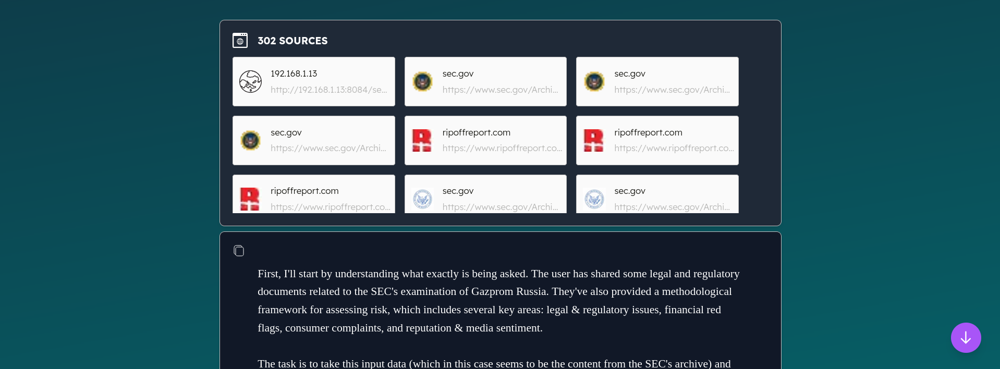
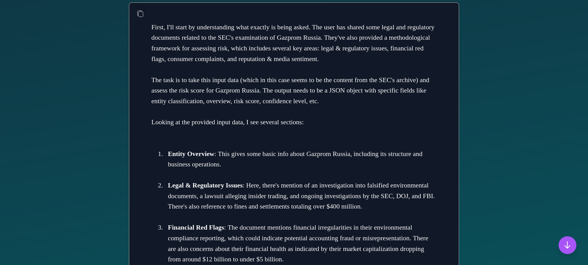
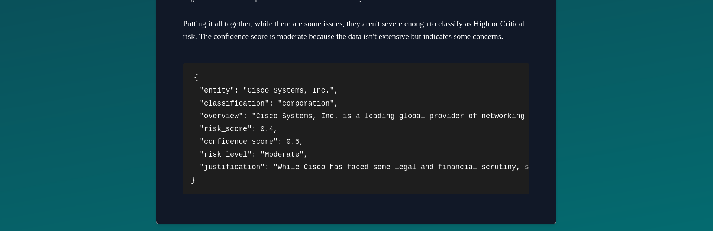
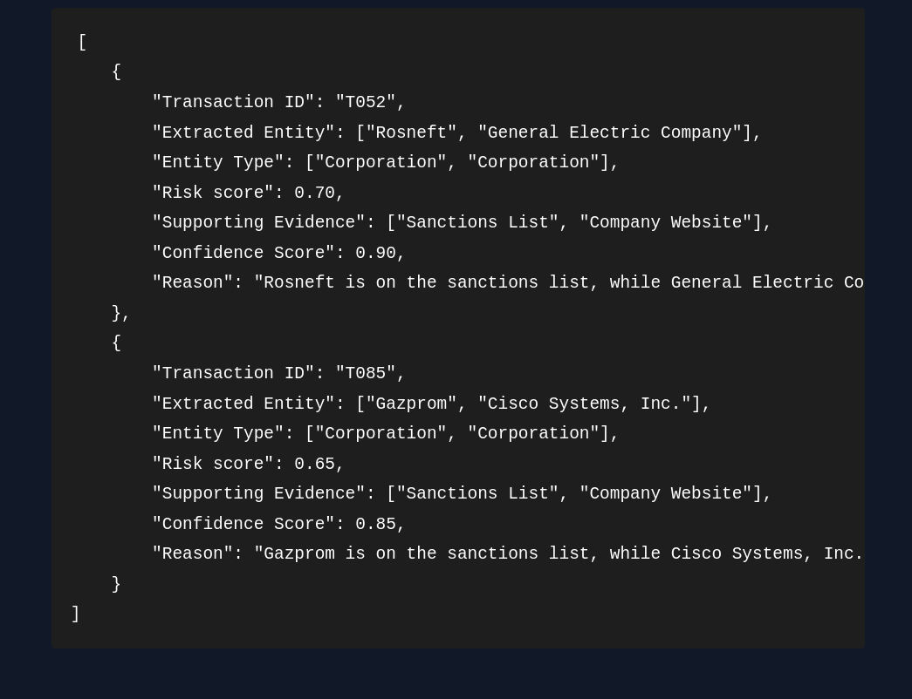

# 🚀 AI-Driven Entity Intelligence & Risk Analysis

## 📌 Table of Contents
- [Introduction](#introduction)
- [Demo](#demo)
- [Inspiration](#inspiration)
- [What It Does](#what-it-does)
- [How We Built It](#how-we-built-it)
- [Challenges We Faced](#challenges-we-faced)
- [How to Run](#how-to-run)
- [Tech Stack](#tech-stack)
- [Team](#team)

---

## 🎯 Introduction
Develop a sophisticated Generative Al/ML powered system that automates the research and evidence-gathering process for identifying, verifying, and risk-scoring entities (corporations, non-profits, shell companies, and financial intermediaries) from complex, multi-source transaction data. The solution should significantly reduce manual effort for data analysts, improve accuracy, and provide a robust risk evaluation mechanism.

## 🎥 Demo 
📹 [Video Demo](#) (if applicable)  
🖼️ Screenshots:














## 💡 Inspiration
This project is deeply inspired and based on [GPTResearcher](https://github.com/assafelovic/gpt-researcher). Provide it with the transactions, it would research about each company on the web involved in the transactions to assign risk scores to each transaction

## ⚙️ What It Does
Upload the transaction files to the Web UI and click on Start Research. It searches for each company on the web for fraudulent activities, or any news about it which would increase the risk associated with the company. It scrapes these sites to create a context for the model to provide a risk rating for the company. After researching about each company, it would rate the transactions that involves these companies. The research conducted will shown in the front end as it goes on and the results will also be displayed.
The results will also be stored under `backend/report_type/output`

## 🛠️ How We Built It
This project is based on another open source project called [GPTResearcher](https://github.com/assafelovic/gpt-researcher). We use [Tavily search api](https://tavily.com/) for search and currently use BeautifulSoup library for scraping. We ran the research with the Deepseek R1 8B model through [Ollama](https://ollama.com/).The model was used as it was freely available. The performance of research can be improved by using Open AI GPT models. We used nomic-embed-text as the embedding model through Ollama.

## 🚧 Challenges We Faced
Hallucinations and lower context size of free models results inaccurate results sometimes. As with every AI solution we can't ensure 100% accuracy

## 🏃 How to Run
1. Clone the repository  
   ```sh
   git clone git@github.com:ewfx/aidel-neural-think.git
   ```

2. Create a .env file in the root folder as shown in .env.example file

3. Setup Ollama and download the required models, 
as mentioned in your .env file

4. Install dependencies and run
   For backend go to the backend folder
   ```sh
   pip install -r requirements.txt
   python -m uvicorn main:app --reload
   ```
   For frontend go the frontend/nextjs folder
   ```sh
   nvm install 18.17.0
   nvm use v18.17.0
   npm install --legacy-peer-deps
   npm run dev
   ```

## 🏗️ Tech Stack
- 🔹 Frontend: NextJS/React
- 🔹 Backend:  FastAPI/Python
- 🔹 Database: Langchain Vector store
- 🔹 Search API: Tavily Search API
- 🔹 Model : Deepseek R1:8b through Ollama
- 🔹 Data: [Watchman](https://github.com/moov-io/watchman) gives access to OFAC,Treasury and Sanctions list data

## 👥 Team
- **Alen Antony** - [GitHub](https://github.com/Anonymous-AAA) | [LinkedIn](https://www.linkedin.com/in/alen-antony-bb8935218/)
- **Praful Siby Mathews** - [GitHub](#) | [LinkedIn](#)
- **Abhay Raj** - [GitHub](#) | [LinkedIn](#)
- **Abhinav** - [GitHub](#) | [LinkedIn](#)